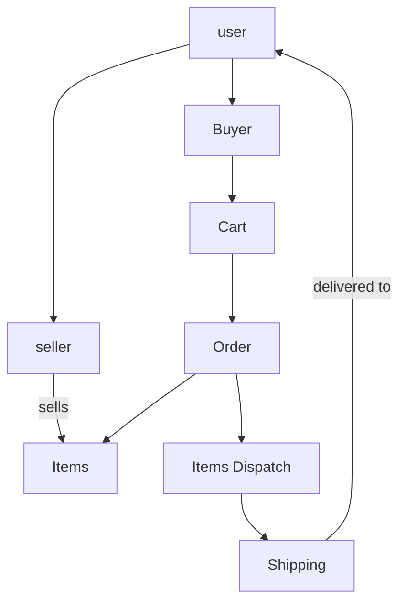

 ## Describe the architecture of a typical Rails application

Ruby on Rails is optimised for the Model-View-Controller programming design pattern. A typical Ruby on Rails application will consist of  these aforementioned folders, which, along with many other helper    folders, enables developers to separate concerns. The model interacts    with our database and is a “model” for the data that is to be          collected and stored. Data validation and integrity can be done on       the model. The controller handles the majority (if not all) of the       business logic and communicates between the view and the model. The      view can be constructed by using either the in-built scaffold views,     which utilises embedded ruby (ERB) by default, or alternatively a        separate front-end framework. Ruby on Rails can be integrated with       react, vue.js or any other framework, allowing developers greater        flexibility in their tech stack. However, by default ERB can be used to display an output, usually styled with css, a material design     framework, output directly to HTML or parsed as JSON through an API  call. ERB aim's to facilitate DRY (Don't Repeat Yourself) principles by allowing developers to create partial views that allow for nested components. This separation of concerns allows for programmers to focus on the various parts of an application, either for maintenance or to build out API features.

source: [https://rubyonrails.org/](https://rubyonrails.org/)

## Identify a database commonly used in web applications (including Rails) and discuss the pros and cons of this database

Postgres is a free to use, open source, relational database system used in the tech industry to manage and store data. Although, it packs some powerful features, Postgres does not come with a warranty and there is no liability or indemnity protection. This could potentially cause issues if data is corrupted from an update (of Postgres). Additionally, a variety of performance and backup recovery challenges can occur with Postgres users. As a consequences of Postgres’s relational database structure each query begins from the first row and reads through the entire table to find relevant data - which may be fine for small datasets with SQL queries - however, may seriously impact performance at scale with an abstracted database query (through Rails for example). In summary, Postgres would be fine for most hobby programming purposes, as well as some commercial purposes, but possibly not for mission critical data storage and manipulation.

sources at: [https://www.postgresql.org/](https://www.postgresql.org/)
sources at:[https://www.trustradius.com/products/postgresql/reviews](https://www.trustradius.com/products/postgresql/reviews)

## Discuss the implementation of Agile project management methodology

Agile project management facilitates an iterative and incremental approach to delivering upon criteria within a project life cycle. The main precepts for agile project management foster flexibility, trust, empowerment of the group and collaboration with group members and other groups. Agile project management can be implemented through a variety of different methods. Some of the more popular methodologies include: Scrum, Kanban, Extreme Programming and the Adaptive Project Framework. One of the most popular implementations of the agile philosophy is the scrum method. Scrum is made up for a series of components: team roles, events and ceremonies as well as artefacts and rules.
The major roles include: The product owner, The ScrumMaster and the Development team. The ScrumMaster operates as a servant leader to the group, facilitating growth by either scheduling meetings with important stakeholders to update progress and/or to  request further resources. The ScrumMaster's main purpose is to build and retain a relationship with the projects key stakeholder: The Product Owner. This person may represent a client an internal or external customer (i.e. in the case of start-up accelerator's). There is only one Product Owner and they are accountable for the mission, vision and overall product outcome. The development team is then connected to the product owner through the scrum master via a series of ritualistic and routine encounters: usually daily stand-ups, sprint reviews, sprints and the retrospective (done at the end of sprints to see where to improve for the next sprint). This is just one implementation of the agile project management ideology. 

[http://users.jyu.fi/~mieijala/kandimateriaali/Agile-Manifesto.pdf](http://users.jyu.fi/~mieijala/kandimateriaali/Agile-Manifesto.pdf)

[https://link.springer.com/chapter/10.1007/978-3-319-38891-5_8](https://link.springer.com/chapter/10.1007/978-3-319-38891-5_8)
## Provide an overview and description of a standard source control process

Git was developed by Linus Torvalds in 2005 to manage versions of files and folders. Version control is particularly powerful, as it allows for various iterations of work to be stored in an organised and searchable way. This allows users to make multiple instances of their work, in an organised and useful way. Gits’ distributed, version control system also allows for collaboration between programmers, and, or in conjunction with each Git directory on every computer allows for full version tracking capabilities regardless of access to a network or centralised server. However, git is further enhanced, particularly in team-based settings, by the various cloud-based version control systems: Github and Bitbucket, among others.

[https://www.ncbi.nlm.nih.gov/pmc/articles/PMC4718703/](https://www.ncbi.nlm.nih.gov/pmc/articles/PMC4718703/)

## Provide an overview and description of a standard software testing process

Software testing can take various forms through the software development lifecycle. It is also dependent on the overall development methodology. Component and Test Driven Development are currently the two main methods for developing software - with component driven being suited for the model-view-view-controller architecture and test driven for model-view-controller. Standard software testing in a model-view-controller architecture would involve setting up test functions. Test Driven Development is the continual cycle of writing tests that fail initially and pass when the necessary code is written to accept and handle inputs and outputs in a predictable and measured way. Tests can then be examined by other teams within the organisation Development Operations would focus on optimising for mass market use or Quality Assurance would look at producing a secure product that maintains the privacy and security of the user as well as performs as expected. Component based software testing, utilises storybook, which allows developers to create a searchable index of components (with their styles and events).

[https://storybook.js.org/](https://storybook.js.org/)
[https://www.researchgate.net/publication/327395450_Evaluating_the_effectiveness_of_test_driven_development_Advantages_and_pitfalls](https://www.researchgate.net/publication/327395450_Evaluating_the_effectiveness_of_test_driven_development_Advantages_and_pitfalls)

## Discuss and analyse requirements related to information system security

The requirements for information system security are dependent on the developer's risk exposure level and eagerness to be future employed. Information system security is paramount in the software development process as it works to maintain the integrity of systems, while protecting users from malicious attacks. There are a variety of inbuilt security mechanisms for web-developers. Google, controversially enforces HTTPS, which some developers argue may be ‘over-kill’ for statically served sites, delivering content only (blogs for example). However, HTTPS is considered essential for handling credit card data, accessing the camera and so forth. There are other standard practices such as hashing sensitive data before storing on a database (user passwords), handling of credit numbers through a 3rd party licensed service (stripe, paypal, etc). 

[https://www.sciencedirect.com/science/article/pii/S1877050917300546](https://www.sciencedirect.com/science/article/pii/S1877050917300546)
## Discuss common methods of protecting information and data

There are a variety of methods for protecting user information and data. One of the most recent methods is the introduction of Two-Factor Authentication. This forces the user to authenticate themselves using a known 2nd device such as a mobile phone, tablet or other computer. Two-factor authentication can be hacked through various sim-hacking methods: simply calling up and asking for your mobile number to be changed from one sim card to another, or even intercepting emails to accept alternative two-factor authentication methods. There are other methods for protecting data: facial, voice and fingerprint recognition is utilised by most developers to authenticate users for a variety of purposes ranging from banking through to human services.

[https://academic.oup.com/idpl/article/8/1/29/4930711](https://academic.oup.com/idpl/article/8/1/29/4930711)

## Research what your legal obligations are in relation to handling user data

Developers have a legal obligation to handle data in moral and ethical ways. In particular, there are laws governing the handling of credit card and identification data. The handling of financial data requires certification of the software through a thorough audit process, which is usually cost prohibitive to most e-commerce companies. These companies tend to use 3rd party payment solutions, such as stripe, paypal and skrill, to handle customer transactions. Identification data is also handled similarly, but with less legal scrutiny, with either the company (facebook for example) issuing a disclaimer with requests for permission of access to personal data. 

[https://iclg.com/practice-areas/data-protection-laws-and-regulations/australia](https://iclg.com/practice-areas/data-protection-laws-and-regulations/australia)

## Describe the structural aspects of the relational database model. Your description should include information about the structure in which data is stored and how relations are represented in that structure.

Relational databases aim to minimise data redundancy by creating various tables of data and modelling relationships between them. The primary key of one table may be a User ID which then becomes the foreign key of another table. This forges a relationship between the User table (containing user details: name, password, etc) and another table, for example: clothes. The user with ID has many clothes and clothes are associated to the user through the User ID (foreign key). This concept can further be explored through layered many-to-many table relationships. In this way we can, curate associations between various data through the process that connect them. More specifically we could, for example, connect flights with passengers through a schedule (with the schedule table having two foreign keys - the primary key of the plane and the primary key of the user).

[https://www.ibm.com/support/knowledgecenter/SSWT9A_7.6.0/com.ibm.mbs.doc/configur/r_ctr_db_structures.html](https://www.ibm.com/support/knowledgecenter/SSWT9A_7.6.0/com.ibm.mbs.doc/configur/r_ctr_db_structures.html)
## Describe the integrity aspects of the relational database model. Your description should include information about the types of data integrity and how they can be enforced in a relational database.**

Data integrity is vital to any sort of database model. In a relational database, developers have multiple avenues of action to maintain the data integrity. This can be done through client-side validation (with HTML5), through to validation of data types on the model. Data integrity starts with: "is there a value?", then it moves to: "is it the right data-type?" and then for additional granularity developers can set range specific values: between 1 and 10 people for instance (i.e. for ordering seats at the cinema). Data integrity is maintained by ensuring multiple stages of data validation, and ensuring data is only saved once it has passed these "filters" and then properly sanitised. 

[https://www.varonis.com/blog/data-integrity/](https://www.varonis.com/blog/data-integrity/)

## Describe the manipulative aspects of the relational database model. Your description should include information about the ways in which data is manipulated (added, removed, changed, and retrieved) in a relational database.

Data is manipulated in a relational database using C.R.U.D methods. This encompasses the use of create, read, update and delete functions. In ruby on rails CRUD operations can be performed when the user is given access to a database that allows them to create, read and update data. In ruby on rails data can be created through a variety of methods: seeding a database (such as the default sql lite or postgres) or by creating user forms. Permission must be given to the user to perform various actions and often users are splintered into at least two main groups: admin and user. Rolify, CanCan and Pundit among others are gem's used to manage user access to the CRUD actions of the database and as such are vital to maintaining data value and integrity.

[https://guides.rubyonrails.org/routing.html#crud-verbs-and-actions](https://guides.rubyonrails.org/routing.html#crud-verbs-and-actions)

## Identify and explain the workings of TWO sorting algorithms and discuss and compare their performance/efficiency (i.e. Big O)

There are various sorting algorithms used to sort through datasets. It is important to use the correct sorting algorithm for the dataset, as expensive operations can lead to revenue loss at scale. Quicksort and Merge Sort are two popular sorting algorithms used to sort datasets. Merge sort can be used on any type of dataset irrespective of its size, whereas quicksort becomes far less efficient with larger datasets. Quick sort is an internal sorting method, and as such data is stored in main memory. Its worst case complexity is of O(n2) which is of quadratic difficulty. Merge sort, however, has a worst case scenario complexity of 0(nlogn). This allows it to work more efficiently and faster than quick sort to find a result in the case of larger datasets. Quicksort, is still useful for sorting smaller datasets. Merge sort, requires has an additional storage requirement as it is an external sorting algorithm.

As you can see on the graph below an 0(nlogn) becomes far more time efficient at scale. Whereas the Quicksort algorithm of 0(n2) is fast with smaller datasets and fewer operations, it becomes rapidly inefficient as both of those factors scale.

[https://www.geeksforgeeks.org/quick-sort-vs-merge-sort/](https://www.geeksforgeeks.org/quick-sort-vs-merge-sort/)

 

## Identify and explain the workings of TWO search algorithms and discuss and compare their performance/efficiency (i.e. Big O)**

There are various ways to search through a dataset. This could include utilising either a linear or binary search. A linear search is of O(n) complexity, examples include: iterating through an array one element at a time, without skipping any element to perform an equality search. The time taken to find an element increases at a linear rate in proportion to the number of elements added to the dataset. Conversely, binary search can be far more efficient if elements have been sorted first, allowing the algorithm to perform a comparison search through the elements. The middle value is selected and if it is higher than the target value then the corresponding half of the list is searched. This cuts the time taken in half each time. Binary search has a worst case scenario complexity of O(log n). This makes it vastly more attractive as a searching algorithm for larger, sorted datasets. 

[https://www.andrew.cmu.edu/course/15-110-m12/applications/ln/Unit05PtBPtC.pdf](https://www.andrew.cmu.edu/course/15-110-m12/applications/ln/Unit05PtBPtC.pdf)
## Conduct research into a marketplace website (app) and answer the following parts: 

### a. What software is used by the app?

Amazon utilises a mixed tech stack of mostly Java, MySql, AngularJs, Pearl, along with a host of Amazon's own proprietary services that are built upon Java, C, C++ or on-top of other Amazon services. Amazon facilitates the use of relational databases through the Amazon Relational Database Service while Dynamodb caters to the nosql data storage market.

[https://stackshare.io/amazon/amazon](https://stackshare.io/amazon/amazon)

### b. What hardware is used by the app?

Amazon has designed it's own custom hardware, network infrastructure and software. It utilises, custom-made routers with custom protocols that reliably transmit packets to custom built servers. A 25-gigabit fiber network transfer speed was standardized by AWS to retain competitive advantage and handle the vast through-put of traffic from the plethora of Amazon's customers.
[https://www.geekwire.com/2017/amazon-web-services-secret-weapon-custom-made-hardware-network/](https://www.geekwire.com/2017/amazon-web-services-secret-weapon-custom-made-hardware-network/)

### c. Describe the interaction of technologies within the app

User's interact with an Angular.js interface hosted by amazon services. It gives access to the AWS Elastic Beanstalk and Amazon Relational Database's infrastructures. User's establish their relational database (through RoR for example) with MySql used by Amazon to manage store and manage the data. Servers can be scaled horizontally to accommodate user growth and a load balancer is used to effectively serve up websites. 

This can all be seen in this diagram below:

[https://aws.amazon.com/getting-started/projects/launch-lamp-web-app/](https://aws.amazon.com/getting-started/projects/launch-lamp-web-app/)

### d. Describe the way data is structured within the app

Buyers and sellers in the amazon marketplace are not mutually exclusive. However, a user registered as a buyer must register their account as "seller" before they begin selling. This is to ensure legal requirements such as tax file number and identity are supplied before the user can engage in selling.  Therefore, a pseudo- polymorphic relationship exists between the user as a seller or as a buyer. Item's for sale and items purchased retain a many-to-many relationship through the seller-to-buyer relationship.

### e. Identify entities which must be tracked by the app

### f. Identify the relationships and associations between the entities you have identified in part (e)

A user can be either a buyer and or a seller. The items they sell are stored as a separate entity (the items table). Items, loosely speaking, could have a boolean attribute indicating whether they have sold or not. Purchase/Sale history can be derived from a query of the items table. 

### g. Design a schema using an Entity Relationship Diagram (ERD) appropriate for the database of this website (assuming a relational database model)

